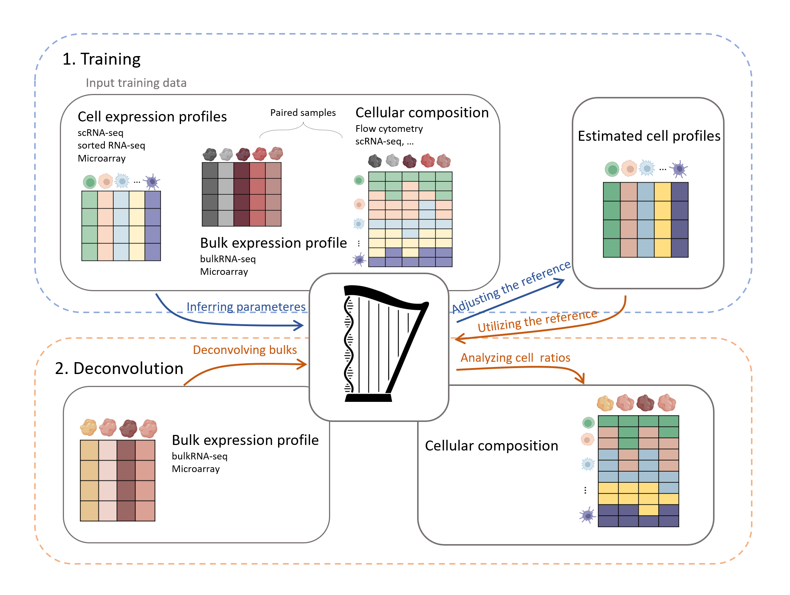

# Harplication

Applying **harp** to real world and simulated data, in order to show its advantage compared to established deconvolution tools.

<div style="text-align: center">
    
</div>

For detailed explanation and examples of the main package functions of harp we refer to the corresponding R package
and its documentation available under [Spang-Lab GitHub](https://github.com/spang-lab/harp).

For the preprint of our manscript, see https://www.biorxiv.org/content/10.1101/2025.02.26.640330v1

Make sure to install the `harp` package

```r
library(devtools)
devtools::install_github("spang-lab/harp")
```

The input data for reproducing the results of the simulations is provided under https://doi.org/10.5281/zenodo.10568550. 
The input data for the real world case studies is provided under https://doi.org/10.5281/zenodo.15650057.


## Repo Structure
In order to showcase and benchmark our algorithm Harp, we designed the `harplication` R package, comprising consistent functions needed for proper benchmarking.

The contents of the modules are as follows:
- `benchmark_<algorithm>.R`: These modules hold functions in order to employ the respective algorithms for benchmarking
- `evaluate_proportions.R`: These functions provide the computation of quality scores and all the plotting utilities
- `preprocess.R`: This holds functions for preprocessing single cell data of the single cell publications used for simulations
- `true_quantities.R`: These functions are used in order to simulate artificial bulk mixtures and determine their ground truth cellular composition
- `helpers.R`: Additional helper functions

Besides this R package, the repository also contains the main scripts in (`scripts/`) in order to provide full reproducibility
of the findings of our manuscripts which we will explain in the following.


## Reproduction of the paper

### Simulations

All the upcoming simulations only depend on single cell data composed of the studies:
- [Dissecting intratumour heterogeneity of nodal B-cell lymphomas at the transcriptional, genetic and drug-response levels](https://www.nature.com/articles/s41556-020-0532-x) by **[Roider et al., 2020]** accessible under [heiDATA ID VRJUNV](https://heidata.uni-heidelberg.de/dataset.xhtml?persistentId=doi:10.11588/data/VRJUNV) or [EGAS00001004335](https://ega-archive.org/studies/EGAS00001004335)
- [The landscape of tumor cell states and ecosystems in diffuse large B cell lymphoma](https://www.cell.com/cancer-cell/fulltext/S1535-6108(21)00451-7) by **[Steen et al., 2021]**, accessibly under [GSE182436](https://www.ncbi.nlm.nih.gov/geo/query/acc.cgi?acc=GSE182436) and [GSE182434](https://www.ncbi.nlm.nih.gov/geo/query/acc.cgi?acc=GSE182434)

As discribed in our manuscript, we use the same preprocessing as 
[Virtual Tissue Expression Analysis](https://doi.org/10.1093/bioinformatics/btae709) by [Simeth et al., 2024].
Thus for reproducing the following simulation study please download the `sc.rds` file from: 
[10.5281/zenodo.10568550](https://doi.org/10.5281/zenodo.10568550).
In order to comply with our pipeline, move this file into `data/source` and rename it to `sc_Steen_Roider.rds`.

In order to make the following steps as accessible as possible we modularized them via associated configs found in
`R/inst/config/config.yaml`. This allows us to re-use scripts by configuring them for the intended usecase.
The steps of our main benchmark comprises:
- Generating input data for the benchmarked algorithms
- Running the deconvolution algorithms
- Evaluating the results

Make sure to always run
```r
devtools::document()
```
because the directories set up in the `config.yaml` are relative to the location of the `harplication` package.


#### Input data generation

As described in our manuscript, we simulate artificial bulk mixtures from the single cells of Roider and compose the single cell library
from Steen data.
This is done by aggregating single cell profiles to arrive at artificial bulk mixtures. Furthermore, we additionally distort
gene expressions in order to simulate further technological variance.

For the main simulation benchmark we configure and run
```r
devtools::document()
source("scripts/simulation/generate_input.R")
```

This will generate a folder within `data/generated` named after the used config, in this case 
`roider_steen_dist`

The main outputs of this step are:
- `bulk_pheno_*`: The simulated FACS data, both with and without simulated cell death (*distortion*) for training harp.
- `bulk_*_summarized_experiment`: A `SummarizedExperiment` dataframe holding the artificial bulk mixtures divided in train and test splits.
- `sc_summarized_experiment`: A `SummarizedExperiment` dataframe for the single cell library.
- `proportions_true`: A dataframe holding the ground truth cell type fractions for each artificial bulk sample.
- `generate_input_simulation.log`: A log file providing further info about the run.

#### Benchmarking Harp against other deconvolution tools

Here we run all the deconvolution algorithms we benchmark harp against (except for CIBERSORTx, as source code is not available, see below).
This script needs to be run after [generation of input data](#input-data-generation)
```r
source("scripts/simulation/infer_proportions.R")
```
If all algorithms are run, this step takes roughly 15 mins. Note that for BayesPrism we use 50 CPU cores.
If you do not want to run all algorithms you can simply modify the `algorithms` entry in the `config.yaml`.


The main outputs of this step are:
- `proportions_<>`: A proportions dataframe for each algorithm, holding the cell type fractions predicted by the respective algorithm.
- `infer_proportions_simulation.log`: A log file providing further info about the run.

Furthermore, this script will produce `CIBERSORT_*.txt`which serve as input for CIBERSORT either for the online version 
https://cibersortx.stanford.edu
or the Docker Container.
Additionally to the current repository we provide a repository that tools the Docker Container to our needs for optimal ease of usage,
see https://github.com/spang-lab/CIBERSORTx_application.
The output of the CIBERSORT runs will automatically be scp'd into the data directory holding the outputs of the other deconvolution tools.

#### Evaluating the deconvolution algorithms

This reporduces the plots for our main simulation benchmark.
This script needs to be run after [benchmarking Harp against other deconvolution tools](#benchmarking-harp-against-other-deconvolution-tools)
```r
source("scripts/simulation/evaluate_proportions.R")
```
Running this script will produce the plots for all metrics comparing the deconvolution algorithms.

#### Additional plots

In the following we reproduce the remaining plots of our manuscript.

#### Cellular composition of single cell studies

This section reproduces the pie charts providing an overview over the patients present
in both single cell studies used for simulations

```r
source("scripts/simulation/sc_study_overview.R")
```


##### Bulk overview

This section reproduces the bulk overview plots of our manuscript.
This needs to be executed after [generation of input data](#input-data-generation).
```r
source("scripts/simulation/bulk_samples_overview.R")
```

##### Uncertain experimental compositions

This section reproduces the respective section of our manuscript.
This needs to be executed after [generation of input data](#input-data-generation).
```r
source("scripts/simulation/compare_cell_death.R")
```

##### Calibration of regularization

This section reproduces the UMAP plot of our manuscript depciting the learned reference profiles for various
values for the regularization parameter lambda.
Additionally the plots depicting the benchmarked quality metrics in dependence of lambda are plotted.
This script needs to be executed after [generation of input data](#input-data-generation).
```r
source("scripts/simulation/compute_profiles_varying_lambda.R")
source("scripts/simulation/plot_profiles_varying_lambda.R")
source("scripts/simulation/plot_profiles_umap_varying_lambda.R")
```

##### Regularization during corss validation

This section reproduces the plot showing the evolution of the regularization parameter lambda during cross validation in Harp.
This scripts needs to be executed after [benchmarking Harp against other deconvolution tools](#benchmarking-harp-against-other-deconvolution-tools).
```r
source("scripts/simulation/plot_lambda_trajectories.R")
```


##### Harp generalizes stably for sufficient amount of training samples

This section reproduces the corresponding section of our manuscript.
This script works fully standalone as for each given training set size the data is generated,
harp is run and the output is evaluated.
```r
Sys.setenv(R_CONFIG_ACTIVE = "roider_steen_dist_test_samples")
source("scripts/simulation/training_sample_size.R")
```

### Real Data
For evaluation the performance of Harp against other deconvolution tools we also employed real bulk expression data (RNA-seq and microarray), along with their corresponding cell compositions from flow cytometry experiment as well as cell expression profiles measured through sortedRNA-seq and microarray technology.

The data sets we used for deconvolution of RNA-seq data are from the following studies:
- Bulk RNA-seq expression with paired flow cytometry from [System-Wide Associations between DNA-Methylation, Gene Expression, and Humoral Immune Response to Influenza Vaccination](https://journals.plos.org/plosone/article?id=10.1371/journal.pone.0152034) by **Zimmermann et al., 2016**, also accessible under [SDY67](https://science.bostongene.com/kassandra/downloads).
- Sorted RNA-seq expression data from [RNA-Seq Signatures Normalized by mRNA Abundance Allow Absolute Deconvolution of Human Immune Cell Types](https://www.sciencedirect.com/science/article/pii/S2211124719300592?via%3Dihub) by **Monaco et al., 2019**, under GEO accession [GSE107011](https://www.ncbi.nlm.nih.gov/geo/query/acc.cgi?acc=GSE107011).
- Microarray based reference (LM22) from [Robust enumeration of cell subsets from tissue expression profiles](https://www.nature.com/articles/nmeth.3337) by **Newman et al., 2015**, provided by [CIBERSORTx](https://cibersortx.stanford.edu/).
- Micoarray gene expression data from [Robust enumeration of cell subsets from tissue expression profiles](https://www.nature.com/articles/nmeth.3337) by **Newman et al., 2015**, accessible under [GSE65133](https://www.ncbi.nlm.nih.gov/geo/query/acc.cgi?acc=GSE65133) and the respective flow cytometry data is accessible under [GSE65133](https://www.ncbi.nlm.nih.gov/geo/geo2r/?acc=GSE65133) and in the analysis of [Leveraging heterogeneity across multiple datasets increases cell-mixture deconvolution accuracy and reduces biological and technical biases](https://www.nature.com/articles/s41467-018-07242-6) by **Vallania et al., 2018**. 

The preprocessed data as used in our paper are accessible on Zenodo under [10.5281/zenodo.15650057](https://doi.org/10.5281/zenodo.15650057). For reproducing the results of the benchmark and anaylsis of our manuscript, please download the following files and move them into `data/source`. 
 - File `sdy67_rnaseq_ref.rds` for the analysis of the deconvolution benchmark of bulkRNA-seq expression data using a reference derived from sortedRNA-seq data.
 - File `sdy67_microarray_ref.rds` for the analysis of the deconvolution benchmark of bulkRNA-seq expression data using a reference derived from microarray data (LM22).
 - File `GSE65133_microarray.rds` for analysis of deconvolution benchmark of expression data using a reference derived from microarray data (LM22).

#### Benchmarking Harp against other deconvolution tools

Here, we run the deconvolution algorithms to benchmark Harp against competing tools, except for CIBERSORTx, as its source code is not available.
These scripts also generate the input .txt files for CIBERSORTx. 
Please also download `CIBERSORT_bulk_counts_gse65133_unnormalized.rds` using the provided link above, which is one additional file for input of CIBERSORTx (LM22), in our microarray expression benchmark.

```r
source("scripts/real_data/sdy67_rnaseq_reference/infer_proportions.R")
source("scripts/real_data/sdy67_microarray_reference/infer_proportions.R")
source ("scripts/real_data/GSE65133/infer_proportions.R")
```

If you do not want to run all algorithms you can simply modify the `algorithms <- c()` entry in the respective scripts. To run the model with a specific number of training and test samples, as well as a specific number of folds (for `Harp` training) for a given scenario , you need to update the values of `train_size`, `test_size`, and `n_folds` on lines `35–37` in each respective script. By default, these values are set to `train_size = 150`, `test_size = 100`, and `n_folds = 5` for `RNA-seq` data, and `train_size = 12`, `test_size = 8`, and `n_folds = 2` for `microarray` data.

The outputs of this step are saved in `data/generated/sdy67_rnaseq_reference_<>train_<>test_<>run`, `data/generated/real_data/sdy67_microarray_reference_<>train_<>test_<>run` and `data/generated/real_data/GSE65133_<>train_<>test_<>run`. The main outputs are:
- `proportions_all_<>.rds`: A data frame including all the deconvolution results and the ground-truth data, so it can be used for futhur evaluation, especially for quality metrics related to cell compositions.
- `infer_proportions_<>.log`: A log file providing further info about the run.
- `output_harp_run_<>.rds`: A list including the training and deconvolution results of Harp.
- `bp_res_bayesPrism_run_<>.rds`: A BayesPrism object containing BayesPrism's default output (see our publication for details).
- `bp_res_bayesPrism_harp_run_<>.rds`: A BayesPrism object containing the output of BayesPrism using the Harp reference.

The inputs for CIBERSORTx, genetated by the scripts, are:
- `CIBERSORTx_bulks_run_<>.txt`: A file containing bulk expression profiles for deconvolution.
- `CIBERSORT_bulk_counts_gse65133_unnormalized_run_`: A file containing micorarry bulk expression profiles for deconvolution using LM22.
- `CIBERSORTx_sigmatrix_harp_reference_run_<>.txt` or `CIBERSORTx_harpref_run_<>`: A file providing the harp reference for CIBERSORTx for bulk RNA-seq or microarray expression data.
- `CIBERSORTx_refsample_run_<>.txt`: Files to generate the signature matrix by CIBERSORTx using sorted RNA-seq data. The microarray based reference (LM22) is available on the CIBERSORTx website.


#### Evaluation of the benchmark

The plots of the results related to **cell compositions quality scores**  and  **bulk recounstruction performance** can be generated by:
```r
source("scripts/real_data/sdy67_rnaseq_reference/evaluate_proportions_bulks.R")
source("scripts/real_data/sdy67_microarray_reference/evaluate_proportions_bulks.R")
source ("scripts/real_data/GSE65133/evaluate_proportions_bulks.R")
```

If you have modified `train_size`and `test_size` in the previous step, you also need to modify them in `evaluate_proportions_bulk.R` scripts on lines `13-14`.
However, prior to this step, you first need to post-process the output of CIBERSORTx.
- For analysis of the bulk RNA-seq expression data, 

If you do not already have results using the CIBERSORTx Docker image (described above), please place the `.txt` files from the CIBERSORTx output into the `data/generated/sdy67_rnaseq_reference_<>train_<>test_<>run` and `data/generated/real_data/sdy67_microarray_reference_<>train_<>test_<>run` directory. Ensure that the file name patterns match those expected by the following scripts, as indicated by the comments within each script: `scripts/real_data/post_processing_CIBERSORTx_rnaseq/infer_sdy67_rnaseq_cibersortx.R` and `scripts/real_data/post_processing_CIBERSORTx_rnaseq/infer_sdy67_microarray_cibersortx.R`.

- For analysis of the microarray expression data, 
please place the `.txt` files from the CIBERSORTx output in `data/generated/real_data/GSE65133_<>train_<>test_<>run` and make sure the filenames align with the expectations outlined in the script `scripts/real_data/post_processing_CIBERSORTx_microarray/infer_GSE65133_cibersortx.R`
 , according to the comments within the script.

Note that if you have modified `train_size`and `test_size` in the previous step, you also need to modify them on lines `12-13` in `infer_<>_cibersortx.R` scripts.
Then the post-processed files for CIBERSORTx can be produced by:
```r
source("scripts/real_data/post_processing_CIBERSORTx_rnaseq/infer_sdy67_microarray_cibersortx.R")
source("scripts/real_data/post_processing_CIBERSORTx_rnaseq/infer_sdy67_rnaseq_cibersortx.R")
source("scripts/real_data/post_processing_CIBERSORTx_microarray/infer_GSE65133_cibersortx.R")
```

#### Additional Plots

In the following, we reproduce the remaining plots from the real data analysis in our publication. Each UMAP plot is saved in its respective scenario directory.
##### UMAP of recounstructed bulk samples

- The UMAP of reconstructed bulk profiles using a sorted RNA-seq-derived reference, compared to observed bulk RNA-seq data, as shown in the introduction of our publication.
```r
source("scripts/real_data/UMAP/umap_bulk_intro.R")
```
- The UMAP of reconstructed bulk samples using a reference from Harp and the reference from data , compared to observed bulk expression data, as shown in the results section of our publication.
```r
source("scripts/real_data/UMAP/umap_bulks_sdy67_rnaseq.R")
source("scripts/real_data/UMAP/umap_bulks_sdy67_microarray.R")
source("scripts/real_data/UMAP/umap_bulks_lm22_GSE65133.R")
```
##### UMAP of cell references
The UMAP represents the sorted RNA-seq cell profiles and the averaged reference. This plot is shown in the appendix of our publication.
```r
source("scripts/real_data/UMAP/umap_reference.R")
```

## Reference

The results of our work are comprised in the following publication:\
**Harp: A Platform Independent Deconvolution Tool** by\
Zahra Nozari, Paul Hüttl, Jakob Simeth, Marian Schön, James A. Hutchinson, Rainer Spang, 2025.\
Preprint available under: https://www.biorxiv.org/content/10.1101/2025.02.26.640330v1.